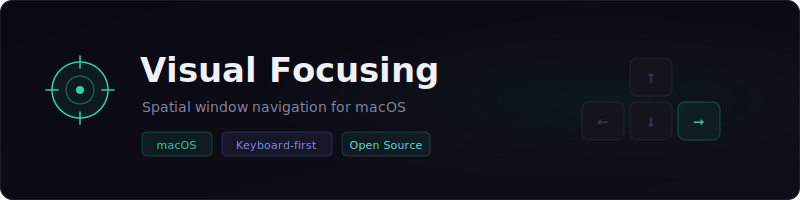
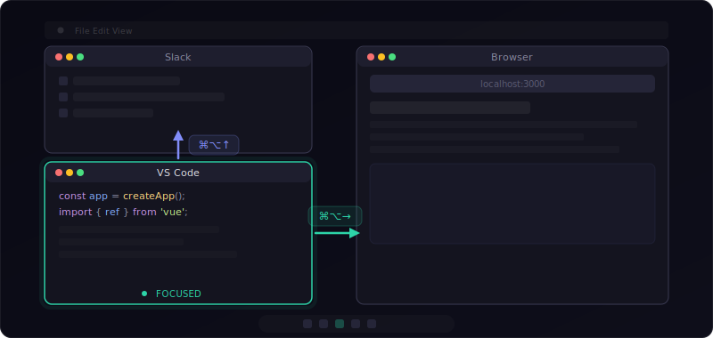

# 🎯 Visual Focusing

<div align="center">



[](./LICENSE)
[](#)
[](https://github.com/wasichris/visual-focusing/releases)

🌐 [Official Website](https://wasichris.github.io/visual-focusing/) | 📦 [Download](https://github.com/wasichris/visual-focusing/releases) | [繁體中文](./README.zh-TW.md)

</div>

Visual Focusing lets you switch to the nearest window in any direction (up, down, left, right) using customizable hotkeys. No mouse needed — just press a shortcut and the smartest candidate window gets focused instantly.

---

## ✨ Why Visual Focusing?

- **Spatial & intuitive** — Switch windows the way they're laid out on screen, not by alt-tabbing through a list.
- **Visibility-aware** — The algorithm considers actual visible area, z-order, and overlap to pick the right window, not just distance.
- **Works everywhere** — Global hotkeys work no matter which app is focused.
- **Stays out of the way** — Lives in your menu bar. Optionally hides from the Dock. Optionally launches at login.
- **Fully customizable shortcuts** — Record any modifier+key combo you like.

---

## 🚀 Quick Start

### Download

Grab the latest `.dmg` from [Releases](../../releases), or build from source:

```bash
git clone <repo-url> && cd visual-focusing
npm install
npm run build:all   # outputs to release/
```

### Install

1. Open the `.dmg` and drag **Visual Focusing** to Applications.
2. If macOS blocks the app, run:
   ```bash
   xattr -cr "/Applications/Visual Focusing.app"
   ```
3. Launch the app and grant **Accessibility** permission when prompted.

---

## ⌨️ Default Shortcuts

| Direction | Shortcut    |
| --------- | ----------- |
| ↑ Up      | `⌘ + ⌥ + ↑` |
| ↓ Down    | `⌘ + ⌥ + ↓` |
| ← Left    | `⌘ + ⌥ + ←` |
| → Right   | `⌘ + ⌥ + →` |

All shortcuts are fully customizable in the settings window.

---

## 🖥️ How It Works



Press `⌘⌥→` in VS Code → focuses Browser. Press `⌘⌥↑` in VS Code → focuses Slack.

### Smart Window Selection Algorithm

1. **Visibility filtering** — Completely occluded windows are excluded.
2. **Direction & overlap check** — Only windows in the correct direction that share the relevant axis overlap are considered.
3. **Priority grouping** — Overlapping windows > non-overlapping windows > fullscreen-containing windows.
4. **Scoring** — `score = visibleRatio × 500 − distance − zOrder × 50`

---

## ⚙️ Settings

| Option                    | Description                                                                                   |
| ------------------------- | --------------------------------------------------------------------------------------------- |
| Enable shortcuts          | Toggle global hotkeys on/off                                                                  |
| Hide Dock icon on close   | App disappears from Dock when the settings window is closed; accessible via the menu bar icon |
| Launch at login           | Automatically start Visual Focusing when you log in                                           |
| Debug log                 | Verbose logging in the console for development                                                |

---

## 🛠️ Development

### Requirements

- macOS 10.13+
- Node.js 20.14+

### Setup

```bash
npm install
npm run dev        # start dev server + Electron
```

### Project Structure

```
src/
├── main/                  # Electron main process
│   ├── index.ts           # App entry, tray, IPC handlers
│   ├── windowManager.ts   # Window detection & scoring algorithm
│   ├── shortcutManager.ts # Global shortcut registration
│   ├── permissions.ts     # Accessibility permission checks
│   ├── logger.ts          # Logging utility
│   └── preload.ts         # Context bridge
├── renderer/              # React UI
│   ├── App.tsx
│   ├── main.tsx
│   └── components/
│       ├── Settings.tsx       # Settings panel
│       └── ShortcutInput.tsx  # Shortcut recording input
└── shared/
    └── types.ts           # Shared TypeScript types
```

### Build Scripts

| Script              | Description                                      |
| ------------------- | ------------------------------------------------ |
| `npm run dev`       | Start development environment                    |
| `npm run build`     | Compile source code (icons + renderer + main)    |
| `npm run build:all` | Compile + package into `.dmg` / `.zip` installer |

### Tech Stack

- **Electron** — Desktop application framework
- **React** — Settings UI
- **TypeScript** — Type safety
- **node-window-manager** — Native window enumeration & focus
- **electron-store** — Persistent settings storage

### Release

This project uses [Semantic Versioning](https://semver.org/) and automated releases via GitHub Actions.

**Version format:** `vMAJOR.MINOR.PATCH`

| Bump    | When                                    | Example            |
| ------- | --------------------------------------- | ------------------ |
| `patch` | Bug fixes                               | v1.0.0 → v1.0.1   |
| `minor` | New features, backward compatible       | v1.0.0 → v1.1.0   |
| `major` | Breaking changes                        | v1.0.0 → v2.0.0   |

**How to publish a new release:**

```bash
# 1. Update version (auto-updates package.json, creates git commit & tag)
npm version patch   # or: minor / major

# 2. Push to GitHub (triggers automated build & release)
git push origin main --tags
```

GitHub Actions will automatically build the macOS app (arm64 + x64), create a GitHub Release, and attach the `.dmg` and `.zip` installers.

> **First release only:** If no tags exist yet, create the initial tag manually:
> ```bash
> git tag v1.0.0
> git push origin v1.0.0
> ```

---

## 📄 License

[MIT](./LICENSE)

---

## 🐛 Issues & Contributions

Found a bug or have a feature request? Please open an [issue](../../issues).
