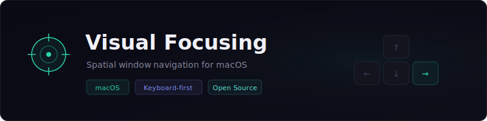
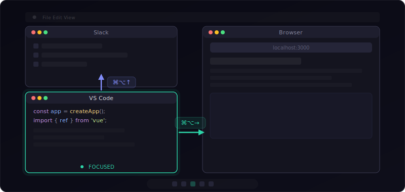

# 🎯 Visual Focusing

<div align="center">



[](./LICENSE)
[](#)
[](https://github.com/wasichris/visual-focusing/releases)

🌐 [官方網站](https://wasichris.github.io/visual-focusing/) | 📦 [下載](https://github.com/wasichris/visual-focusing/releases) | [English](./README.md)

</div>

Visual Focusing 讓你透過自訂快捷鍵，快速切換到上下左右方向最近的視窗。不需要滑鼠，按下快捷鍵就能立即聚焦到最合適的視窗。

---

## ✨ 為什麼選擇 Visual Focusing？

- **空間直覺操作** — 依照視窗在螢幕上的實際位置切換，而非用 Alt-Tab 在清單中翻找。
- **智慧可見性感知** — 演算法會考慮視窗的實際可見面積、Z 軸層序和重疊情況來選擇最佳視窗，而非僅靠距離。
- **全域運作** — 全域快捷鍵在任何應用程式聚焦時都能使用。
- **不打擾工作流程** — 常駐於選單列。可選擇隱藏 Dock 圖示。可選擇開機自動啟動。
- **完全自訂快捷鍵** — 錄製任何你喜歡的修飾鍵＋按鍵組合。

---

## 🚀 快速開始

### 下載

從 [Releases](../../releases) 下載最新的 `.dmg`，或從原始碼建置：

```bash
git clone <repo-url> && cd visual-focusing
npm install
npm run build:all   # 輸出至 release/
```

### 安裝

1. 開啟 `.dmg`，將 **Visual Focusing** 拖曳至「應用程式」資料夾。
2. 如果 macOS 封鎖應用程式，在終端機執行：
   ```bash
   xattr -cr "/Applications/Visual Focusing.app"
   ```
3. 啟動應用程式，並在提示時授予**輔助使用（Accessibility）**權限。

---

## ⌨️ 預設快捷鍵

| 方向   | 快捷鍵      |
| ------ | ----------- |
| ↑ 向上 | `⌘ + ⌥ + ↑` |
| ↓ 向下 | `⌘ + ⌥ + ↓` |
| ← 向左 | `⌘ + ⌥ + ←` |
| → 向右 | `⌘ + ⌥ + →` |

所有快捷鍵都可以在設定視窗中自由自訂。

---

## 🖥️ 運作原理



在 VS Code 按 `⌘⌥→` → 切換到瀏覽器。在 VS Code 按 `⌘⌥↑` → 切換到 Slack。

### 智慧視窗選擇演算法

1. **可見性過濾** — 完全被遮擋的視窗會被排除。
2. **方向與重疊檢查** — 只考慮在正確方向上且在對應軸向有重疊的視窗。
3. **優先度分組** — 重疊視窗 > 不重疊視窗 > 全螢幕包含視窗。
4. **評分機制** — `分數 = 可見比例 × 500 − 距離 − Z軸層序 × 50`
5. **後備搜尋** — 如果目標方向找不到視窗，演算法會在反方向搜尋最近的重疊視窗。

---

## ⚙️ 設定選項

| 選項                     | 說明                                                    |
| ------------------------ | ------------------------------------------------------- |
| 啟用快速鍵               | 開啟/關閉全域快捷鍵                                     |
| 顯示切換通知             | 視窗切換時顯示簡短通知                                  |
| 關閉視窗後隱藏 Dock 圖示 | 關閉設定視窗後，Dock 圖示消失；可透過選單列圖示重新開啟 |
| 開機時自動啟動           | 登入時自動啟動 Visual Focusing                          |
| 啟用除錯日誌             | 在 Console 顯示詳細日誌，供開發用途                     |

---

## 🛠️ 開發

### 系統需求

- macOS 10.13+
- Node.js 20.14+

### 設定開發環境

```bash
npm install
npm run dev        # 啟動 Vite dev server + Electron
```

### 專案結構

```
src/
├── main/                  # Electron 主程序
│   ├── index.ts           # 應用程式入口、Tray、IPC 處理
│   ├── windowManager.ts   # 視窗偵測與評分演算法
│   ├── shortcutManager.ts # 全域快捷鍵註冊
│   ├── permissions.ts     # 輔助使用權限檢查
│   ├── logger.ts          # 日誌工具
│   └── preload.ts         # Context bridge
├── renderer/              # React UI
│   ├── App.tsx
│   ├── main.tsx
│   └── components/
│       ├── Settings.tsx       # 設定面板
│       └── ShortcutInput.tsx  # 快捷鍵錄製輸入元件
└── shared/
    └── types.ts           # 共用 TypeScript 型別
```

### 建置指令

| 指令                | 說明                                 |
| ------------------- | ------------------------------------ |
| `npm run dev`       | 啟動開發環境                         |
| `npm run build`     | 編譯原始碼（圖示 + 前端 + 主程序）   |
| `npm run build:all` | 編譯 + 打包成 `.dmg` / `.zip` 安裝檔 |

### 技術棧

- **Electron** — 桌面應用程式框架
- **React** — 設定介面
- **TypeScript** — 型別安全
- **node-window-manager** — 原生視窗列舉與聚焦
- **electron-store** — 設定持久化儲存

### 發布版本

本專案採用[語意化版本](https://semver.org/lang/zh-TW/)，並透過 GitHub Actions 自動化發布。

**版本格式：** `vMAJOR.MINOR.PATCH`

| 升版類型 | 時機                       | 範例               |
| -------- | -------------------------- | ------------------ |
| `patch`  | Bug 修復                   | v1.0.0 → v1.0.1   |
| `minor`  | 新功能，向後相容           | v1.0.0 → v1.1.0   |
| `major`  | 重大變更，不向後相容       | v1.0.0 → v2.0.0   |

**發布新版本的步驟：**

```bash
# 1. 更新版本號（自動修改 package.json、建立 git commit 與 tag）
npm version patch   # 或：minor / major

# 2. 推送到 GitHub（觸發自動建置與發布）
git push origin main --tags
```

GitHub Actions 會自動建置 macOS 應用程式（arm64 + x64），建立 GitHub Release，並附上 `.dmg` 和 `.zip` 安裝檔。

> **首次發布：** 若尚無任何 tag，請手動建立初始 tag：
> ```bash
> git tag v1.0.0
> git push origin v1.0.0
> ```

---

## 📄 授權

[MIT](./LICENSE)

---

## 🐛 問題回報與貢獻

發現 Bug 或有功能建議？請開啟 [Issue](../../issues)。
