# Visual Focusing 視窗搜尋決策流程圖

本文以**「向上搜尋」**為代表，完整呈現從使用者按下快捷鍵到最終選定目標視窗的決策流程。其他方向（下、左、右）的邏輯結構相同，僅方向判定條件與距離計算軸向不同。

---

## 完整決策流程

```mermaid
flowchart TD
    Start(["🎯 使用者按下「向上切換」快捷鍵"])
    Start --> GetWindows

    %% ===== 階段一：取得與前處理 =====
    subgraph Phase1["階段一：取得視窗列表"]
        GetWindows["呼叫 getAllWindows()<br>取得所有視窗列表"]
        GetWindows --> GetActive["取得當前 Active 視窗"]
        GetActive --> HasActive{{"當前視窗<br>是否存在？"}}
        HasActive -- "否" --> ReturnNull1(["❌ 返回 null<br>無法切換"])
        HasActive -- "是" --> ExcludeCurrent["從列表中排除當前視窗<br>（ID + 位置雙重檢查）"]
    end

    %% ===== 階段二：可見性過濾 =====
    subgraph Phase2["階段二：可見性過濾"]
        ExcludeCurrent --> HasOthers{{"是否有<br>其他視窗？"}}
        HasOthers -- "否" --> ReturnNull2(["❌ 返回 null"])
        HasOthers -- "是" --> VisCheck["逐一計算每個視窗的<br>實際可見面積比例"]
        VisCheck --> VisCalc
        
        subgraph VisCalc["calculateActualVisibleArea()"]
            direction TB
            V1["找出所有 Z-index<br>比目標小（更上層）的視窗"]
            V1 --> V2{{"有上層視窗？"}}
            V2 -- "否" --> V3["可見比例 = 1.0<br>（完全可見）"]
            V2 -- "是" --> V4{{"被任何單一上層視窗<br>完全遮擋？"}}
            V4 -- "是" --> V5["可見比例 = 0<br>（完全不可見）"]
            V4 -- "否" --> V6["計算每個上層視窗<br>的重疊比例"]
            V6 --> V7["可見比例 =<br>1 − 最大重疊比例"]
        end

        VisCalc --> FilterVis{{"可見比例 > 0？"}}
        FilterVis -- "否" --> Exclude["排除此視窗"]
        FilterVis -- "是" --> KeepVis["保留為可見視窗"]
        Exclude --> VisCheck
        KeepVis --> HasVisible
        HasVisible{{"是否有<br>可見視窗？"}}
        HasVisible -- "否" --> ReturnNull3(["❌ 返回 null"])
    end

    %% ===== 階段三：方向搜尋 =====
    subgraph Phase3["階段三：方向判定與篩選（以向上為例）"]
        HasVisible -- "是" --> DirFilter["篩選符合方向條件的視窗"]
        
        DirFilter --> Cond1{{"條件 1：<br>target.y < current.y<br>目標頂部在當前頂部之上？"}}
        Cond1 -- "否" --> Skip1["排除此視窗"]
        Cond1 -- "是" --> Cond2{{"條件 2：<br>有水平重疊？<br>即 X 軸範圍有交集"}}
        Cond2 -- "否" --> Skip1
        Cond2 -- "是" --> PassFilter["✓ 通過方向篩選<br>列為候選視窗"]
    end

    %% ===== 階段四：評分計算 =====
    subgraph Phase4["階段四：計算每個候選視窗的評分"]
        PassFilter --> CalcScore

        subgraph CalcScore["評分公式"]
            direction TB
            S1["① 可見面積分數<br>visibleRatio × 500<br>（最高 500 分）"]
            S2["② 距離懲罰<br>Math.max(0, 當前頂部 − 目標底部)<br>（邊到邊距離，有重疊時為 0）"]
            S3["③ Z-order 懲罰<br>zIndex × 50<br>（越下層懲罰越大）"]
            S1 --> Formula["score = ① − ② − ③"]
            S2 --> Formula
            S3 --> Formula
        end
    end

    %% ===== 階段五：分組與優先度 =====
    subgraph Phase5["階段五：分組排序"]
        Formula --> Classify["判斷每個候選視窗的類型"]

        Classify --> CheckOverlap{{"與當前視窗<br>完全重疊？<br>（X 且 Y 都有重疊）"}}
        CheckOverlap -- "是" --> CheckFS1{{"包含當前視窗<br>且佔螢幕 ≥ 90%？"}}
        CheckFS1 -- "否" --> Group1["🟢 第一組：重疊一般視窗<br>（最高優先）"]
        CheckFS1 -- "是" --> Group3["🔴 第三組：全螢幕包含視窗<br>（最低優先）"]
        CheckOverlap -- "否" --> CheckFS2{{"包含當前視窗<br>且佔螢幕 ≥ 90%？"}}
        CheckFS2 -- "否" --> Group2["🟡 第二組：不重疊一般視窗<br>（中等優先）"]
        CheckFS2 -- "是" --> Group3

        Group1 --> SelectGroup
        Group2 --> SelectGroup
        Group3 --> SelectGroup

        SelectGroup{{"依優先度<br>選擇非空的組別"}}
        SelectGroup -- "第一組有視窗" --> Sort1["第一組按 score 降序排列"]
        SelectGroup -- "第一組空，第二組有" --> Sort2["第二組按 score 降序排列"]
        SelectGroup -- "前兩組皆空，第三組有" --> Sort3["第三組按 score 降序排列"]
        SelectGroup -- "三組皆空" --> Fallback

        Sort1 --> Winner["🏆 選擇 score 最高的視窗"]
        Sort2 --> Winner
        Sort3 --> Winner
        Winner --> ReturnTarget(["✅ 返回目標視窗"])
    end

    %% ===== 階段六：後備搜尋 =====
    subgraph Phase6["階段六：後備搜尋"]
        Fallback["主搜尋無結果<br>啟動後備搜尋"]

        Fallback --> FB_Filter["篩選與當前視窗完全重疊的視窗<br>（X 且 Y 都有交集）"]

        FB_Filter --> FB_Dir{{"Y > 當前視窗 Y？<br>（在下方）"}}
        FB_Dir -- "否" --> FB_Skip["排除"]
        FB_Dir -- "是" --> FB_Type{{"是全螢幕<br>包含視窗？"}}
        FB_Type -- "否" --> FB_Normal["一般視窗候選"]
        FB_Type -- "是" --> FB_FS["全螢幕視窗候選"]

        FB_Normal --> FB_HasNormal{{"有一般視窗<br>候選？"}}
        FB_HasNormal -- "是" --> FB_SortNormal["按 Y 座標升序排列<br>（選最接近的）"]
        FB_SortNormal --> FB_Return(["✅ 返回最近的視窗"])

        FB_HasNormal -- "否" --> FB_HasFS{{"有全螢幕視窗<br>候選？"}}
        FB_FS --> FB_HasFS
        FB_HasFS -- "是" --> FB_SortFS["按 Y 座標升序排列"]
        FB_SortFS --> FB_Return
        FB_HasFS -- "否" --> ReturnNull4(["❌ 返回 null<br>無可切換視窗"])
    end

    %% 樣式
    style Start fill:#4CAF50,color:#fff
    style ReturnTarget fill:#2196F3,color:#fff
    style FB_Return fill:#2196F3,color:#fff
    style ReturnNull1 fill:#f44336,color:#fff
    style ReturnNull2 fill:#f44336,color:#fff
    style ReturnNull3 fill:#f44336,color:#fff
    style ReturnNull4 fill:#f44336,color:#fff
    style Winner fill:#FF9800,color:#fff
    style Group1 fill:#4CAF50,color:#fff
    style Group2 fill:#FFC107,color:#333
    style Group3 fill:#f44336,color:#fff
    style Phase1 fill:#E3F2FD,stroke:#1565C0
    style Phase2 fill:#F3E5F5,stroke:#7B1FA2
    style Phase3 fill:#E8F5E9,stroke:#2E7D32
    style Phase4 fill:#FFF3E0,stroke:#E65100
    style Phase5 fill:#FCE4EC,stroke:#C62828
    style Phase6 fill:#EFEBE9,stroke:#4E342E
```

---

## 四個方向的差異對照

上方流程圖以「向上搜尋」為例。四個方向僅以下部分不同：

| | 向上 | 向下 | 向左 | 向右 |
|---|---|---|---|---|
| **方向條件** | `target.y < current.y` | `targetBottom > currentBottom` | `target.x < current.x` | `targetRight > currentRight` |
| **重疊軸檢查** | 水平重疊 | 水平重疊 | 垂直重疊 | 垂直重疊 |
| **距離計算** | `max(0, currentTop − targetBottom)` | `max(0, targetTop − currentBottom)` | `max(0, currentLeft − targetRight)` | `max(0, targetLeft − currentRight)` |
| **後備搜尋方向** | 往下找 (`Y > current.y`) | 往上找 (`Y < currentBottom`) | 往右找 (`X > current.x`) | 往左找 (`X < currentRight`) |
| **後備排序** | Y 升序（最小 Y） | Y 降序（最大 Y） | X 升序（最小 X） | X 降序（最大 X） |

---

**文檔版本**：v1.0
**最後更新**：2026-02-27
